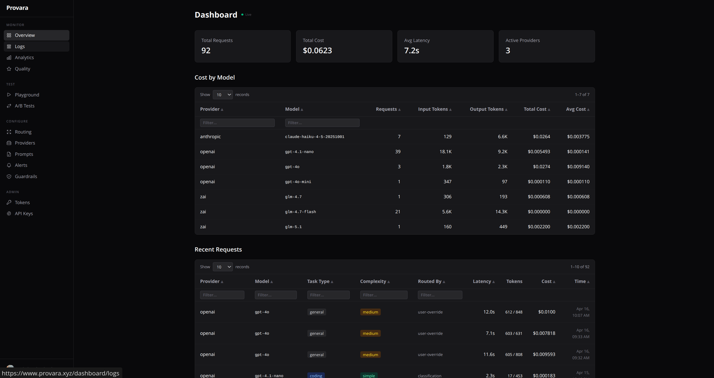
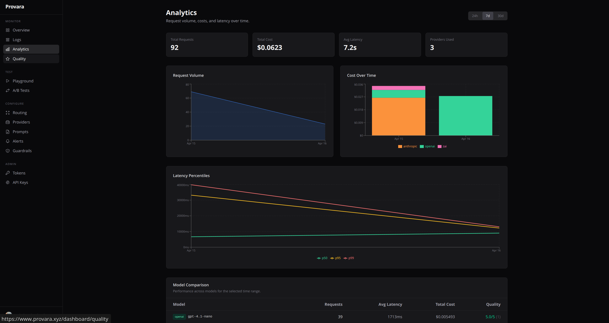
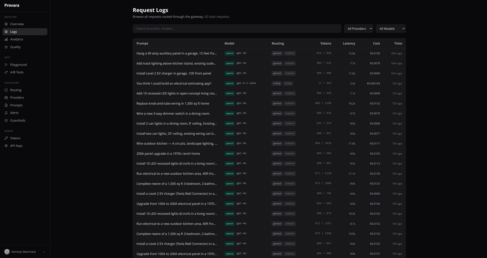
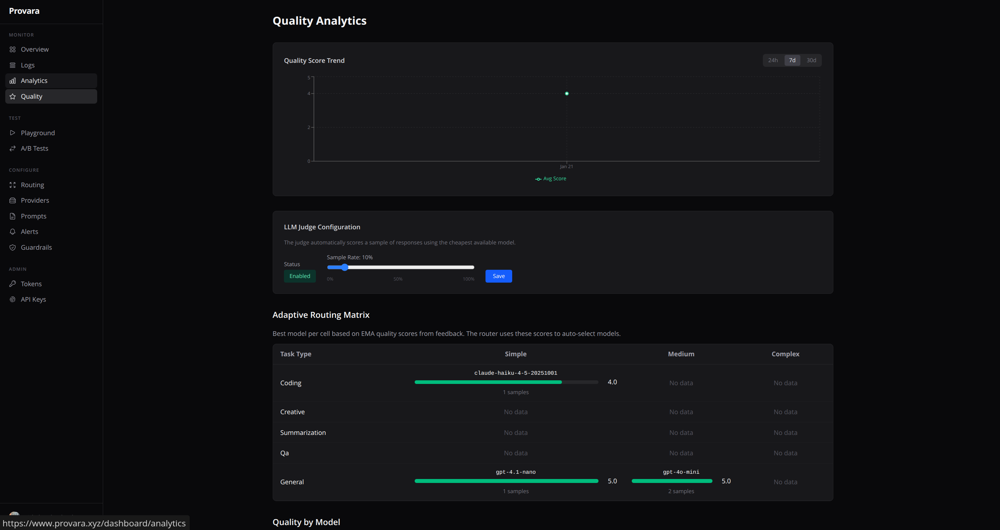
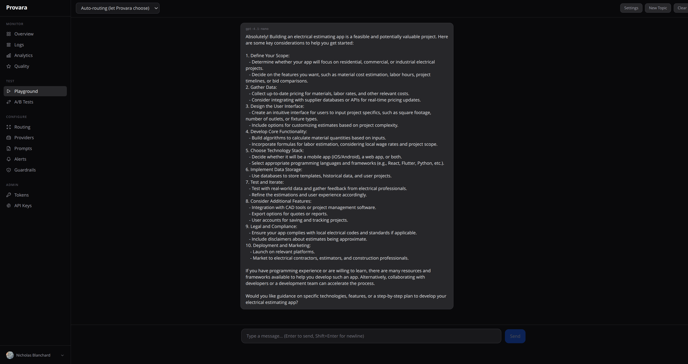
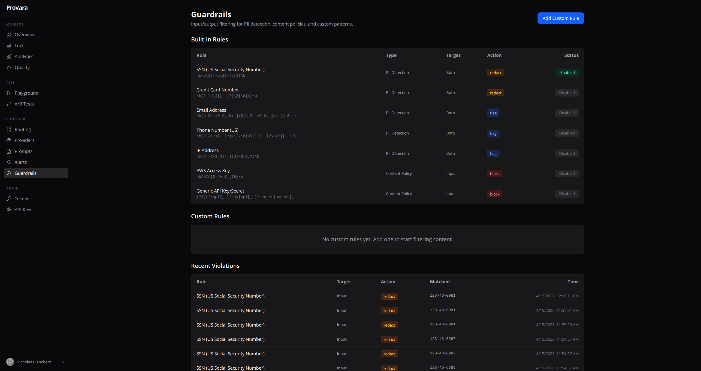
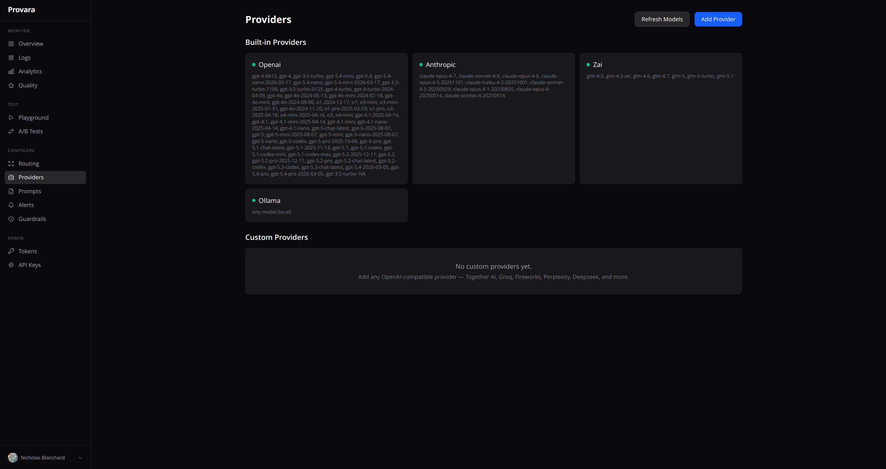
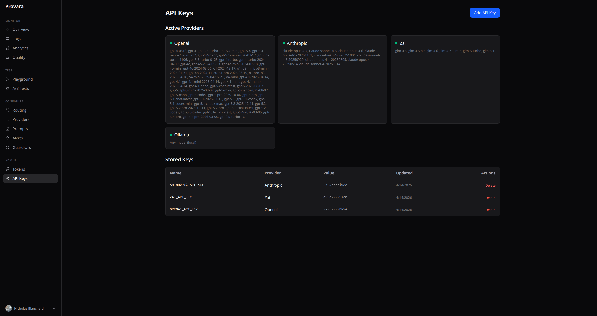
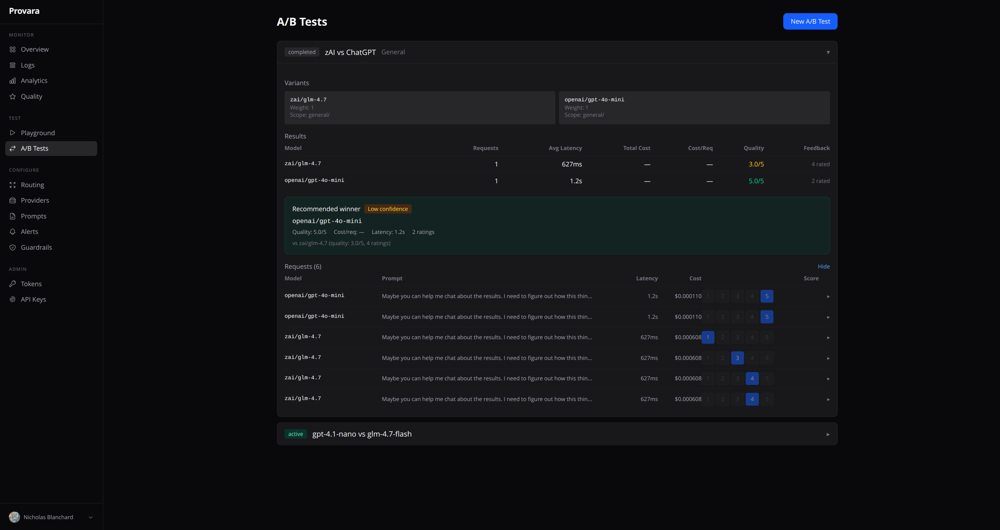
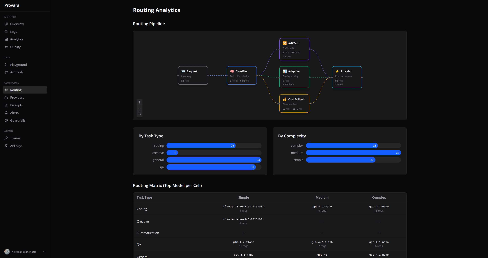

# Provara

Intelligent multi-provider LLM gateway with adaptive routing, A/B testing, and cost optimization. Self-host it or use the managed SaaS.



## Features

- **Intelligent Routing** — Classifies queries by task type (coding, creative, summarization, Q&A, general) and complexity (simple, medium, complex), then routes to the optimal model
- **Adaptive Quality Scoring** — Learns from feedback (user ratings + LLM-as-judge) to auto-optimize which model handles each task type
- **A/B Testing** — Split traffic between models with weighted variants, scoped to routing cells
- **8+ Providers** — OpenAI, Anthropic, Google, Mistral, xAI, Z.ai, Ollama, plus any OpenAI-compatible provider
- **Dynamic Model Discovery** — Automatically detects available models from each provider's API at startup, with on-demand refresh
- **Request Logs & Replay** — Browsable request history with full prompt/response detail, replay any request against a different model with side-by-side diff comparison
- **Observability Dashboard** — Time-series charts for request volume, cost breakdown by provider, latency percentiles (p50/p95/p99), and model comparison tables
- **Quality & Eval Pipeline** — LLM-as-judge auto-scoring with configurable sample rate, quality trends over time, manual 1-5 feedback from the dashboard, adaptive routing matrix
- **Guardrails** — Built-in PII detection (SSN, credit card, email, phone, IP), content policies, and custom regex rules with redact/flag/block actions
- **Alerting** — Configurable rules for spend, latency, and request count thresholds with webhook notifications and alert history
- **Prompt Management** — Versioned prompt templates with `{{variable}}` interpolation, publish/rollback, and API resolution by name
- **Cost Analytics** — Track spend per provider, model, and tenant with detailed cost breakdowns
- **OpenAI-Compatible API** — Drop-in replacement for any SDK that speaks the OpenAI chat completions format
- **Streaming** — Full SSE streaming support with first-chunk fallback detection
- **Response Caching** — In-memory cache for deterministic requests (temperature=0)
- **Multi-Tenant** — OAuth (Google + GitHub), role-based access (owner/member), tenant-scoped data
- **Encrypted Key Storage** — AES-256-GCM encryption for provider API keys at rest
- **Web Dashboard** — Sidebar navigation with grouped sections: Monitor, Test, Configure, Admin

### Screenshots

| | |
|---|---|
|  **Analytics** — Request volume, cost by provider, latency percentiles, model comparison |  **Request Logs** — Searchable request history with prompt, model, routing, tokens, cost |
|  **Quality** — LLM-as-judge scoring, adaptive routing matrix, quality trends |  **Playground** — Interactive chat with model selection or auto-routing |
|  **Guardrails** — PII detection, content policies, custom regex rules |  **Providers** — Auto-discovered models with Refresh Models button |
|  **API Keys** — Encrypted provider key storage with active provider display |  **A/B Tests** — Head-to-head model comparison with quality scoring |

## Quick Start

### Docker (recommended)

```bash
git clone https://github.com/syndicalt/provara.git
cd provara

# Set up environment
cp .env.example .env
# Edit .env with your API keys and PROVARA_MASTER_KEY

docker compose up -d
```

### Local Development

```bash
npm install

# Set up environment
cp .env.example .env

# Start everything (gateway + web dashboard)
npx turbo dev
```

- **Gateway**: http://localhost:4000
- **Dashboard**: http://localhost:3000

## Architecture

```
provara/
├── packages/
│   ├── gateway/        # Hono-based LLM proxy (port 4000)
│   │   ├── src/
│   │   │   ├── auth/         # API tokens, OAuth, sessions, RBAC
│   │   │   ├── classifier/   # Task type + complexity heuristics
│   │   │   ├── routing/      # Adaptive routing engine
│   │   │   ├── providers/    # Provider adapters
│   │   │   ├── routes/       # API endpoints (tokens, feedback, alerts, prompts, etc.)
│   │   │   ├── crypto/       # AES-256-GCM encryption
│   │   │   ├── cost/         # Token pricing and cost calculation
│   │   │   ├── cache/        # In-memory response cache
│   │   │   ├── guardrails/   # Input/output content filtering
│   │   │   └── ab/           # Weighted variant selection
│   │   └── openapi.yaml      # OpenAPI 3.0 spec (import into Yaak/Postman)
│   └── db/             # Drizzle ORM + libSQL/Turso
└── apps/
    └── web/            # Next.js + Tailwind dashboard
        └── src/app/
            ├── page.tsx              # Landing page
            ├── login/                # OAuth sign-in
            ├── models/               # Public model catalog
            └── dashboard/
                ├── logs/             # Request logs + detail + replay
                ├── analytics/        # Time-series charts, cost, latency
                ├── quality/          # Quality scores, judge config, feedback
                ├── playground/       # Interactive model testing
                ├── ab-tests/         # A/B test management
                ├── routing/          # Routing pipeline visualization
                ├── providers/        # Provider management
                ├── prompts/          # Prompt template versioning
                ├── alerts/           # Alert rules and history
                ├── guardrails/       # Content safety rules
                ├── tokens/           # API token management
                └── api-keys/         # Provider key management
```

## How Routing Works



```
Request arrives at POST /v1/chat/completions
  │
  ├─ User specified provider/model? → Use it directly
  │
  ├─ Classify task type (heuristics + LLM fallback)
  │   → coding | creative | summarization | qa | general
  │
  ├─ Classify complexity
  │   → simple | medium | complex
  │
  ├─ Active A/B test on this cell? → Weighted random variant
  │
  ├─ Adaptive routing has quality data? → Pick highest-scoring model
  │
  └─ Fallback → all providers sorted by cost (cheapest first)
```

Each request logs which routing method was used in `_provara.routing.routedBy`:
- `"explicit"` — user specified provider/model
- `"routing-hint"` — user provided a task type hint
- `"ab-test"` — matched an active A/B test
- `"adaptive"` — quality-based adaptive routing
- `"classification"` — classifier picked the route

## A/B Testing Guide


A/B tests let you compare two or more models head-to-head on real traffic. Here's a full walkthrough:

### 1. Create a test

```bash
curl -X POST http://localhost:4000/v1/ab-tests \
  -H "Content-Type: application/json" \
  -d '{
    "name": "GPT-4o vs Claude Sonnet for coding",
    "description": "Compare quality and latency on coding tasks",
    "taskType": "coding",
    "complexity": "medium",
    "variants": [
      { "provider": "openai", "model": "gpt-4o", "weight": 1 },
      { "provider": "anthropic", "model": "claude-sonnet-4-6", "weight": 1 }
    ]
  }'
```

- **taskType** and **complexity** scope the test to a routing cell. Only requests classified as `coding/medium` will be split between variants. Omit them to test across all traffic.
- **weight** controls traffic distribution. Equal weights = 50/50 split. Set `"weight": 3` on one variant for 75/25.

### 2. Send traffic

Route requests through Provara without specifying a model — the router will detect the A/B test and split traffic:

```bash
curl -X POST http://localhost:4000/v1/chat/completions \
  -H "Content-Type: application/json" \
  -H "Authorization: Bearer your-token" \
  -d '{
    "model": "",
    "messages": [
      {"role": "user", "content": "Write a Python function to merge two sorted arrays"}
    ]
  }'
```

The response includes which variant was used:

```json
{
  "_provara": {
    "provider": "anthropic",
    "latencyMs": 1847,
    "routing": {
      "taskType": "coding",
      "complexity": "medium",
      "routedBy": "ab-test"
    }
  }
}
```

### 3. Check results

```bash
curl http://localhost:4000/v1/ab-tests/YOUR_TEST_ID
```

Returns per-variant stats: request count, avg latency, avg tokens, and total cost. You can also view results in the dashboard at `/dashboard/ab-tests`.

### 4. Submit feedback (optional)

Quality scoring makes A/B tests more useful. Rate responses to build quality data:

```bash
curl -X POST http://localhost:4000/v1/feedback \
  -H "Content-Type: application/json" \
  -d '{
    "requestId": "THE_REQUEST_ID",
    "score": 4,
    "comment": "Good answer but missed edge case"
  }'
```

Scores feed into the adaptive routing engine — after enough feedback, Provara will auto-route to the better model even without an A/B test.

### 5. Complete the test

```bash
curl -X PATCH http://localhost:4000/v1/ab-tests/YOUR_TEST_ID \
  -H "Content-Type: application/json" \
  -d '{"status": "completed"}'
```

Or pause it with `"status": "paused"` to stop traffic splitting without losing data.

## API

### Chat Completions (OpenAI-compatible)

```bash
# Let the router pick the best model
curl -X POST http://localhost:4000/v1/chat/completions \
  -H "Content-Type: application/json" \
  -H "Authorization: Bearer your-token" \
  -d '{
    "model": "",
    "messages": [{"role": "user", "content": "Write a Python quicksort"}]
  }'

# Force a specific provider/model
curl -X POST http://localhost:4000/v1/chat/completions \
  -H "Content-Type: application/json" \
  -H "Authorization: Bearer your-token" \
  -d '{
    "model": "claude-sonnet-4-6",
    "messages": [{"role": "user", "content": "Hello"}]
  }'

# Streaming
curl -X POST http://localhost:4000/v1/chat/completions \
  -H "Content-Type: application/json" \
  -H "Authorization: Bearer your-token" \
  -d '{
    "model": "",
    "stream": true,
    "messages": [{"role": "user", "content": "Tell me a story"}]
  }'
```

### Endpoints

| Endpoint | Description |
|---|---|
| **Chat** | |
| `POST /v1/chat/completions` | OpenAI-compatible chat completions (auth required) |
| **Models** | |
| `GET /v1/providers` | List active providers and models |
| `GET /v1/models/stats` | All models with pricing, latency, and quality stats |
| `GET /v1/models/pricing` | Full pricing table |
| **A/B Tests** | |
| `GET /v1/ab-tests` | List all tests |
| `POST /v1/ab-tests` | Create a test |
| `GET /v1/ab-tests/:id` | Test detail with per-variant results |
| `PATCH /v1/ab-tests/:id` | Update status (active/paused/completed) |
| `DELETE /v1/ab-tests/:id` | Delete a test |
| **Feedback** | |
| `POST /v1/feedback` | Submit quality feedback (score 1-5) |
| `GET /v1/feedback` | List feedback entries |
| `GET /v1/feedback/quality/by-model` | Quality scores by model |
| **Analytics** | |
| `GET /v1/analytics/overview` | Summary stats |
| `GET /v1/analytics/requests` | Paginated request log |
| `GET /v1/analytics/requests/:id` | Single request detail with feedback |
| `GET /v1/analytics/timeseries` | Time-series: volume, cost, latency (p50/p95/p99) |
| `GET /v1/analytics/timeseries/cost-by-provider` | Stacked cost breakdown over time |
| `GET /v1/analytics/models/compare` | Model comparison for a time range |
| `GET /v1/analytics/costs/by-model` | Cost breakdown by model |
| `GET /v1/analytics/routing/stats` | Routing traffic by cell |
| `GET /v1/analytics/adaptive/scores` | Adaptive routing EMA scores |
| `GET /v1/cache/stats` | Cache hit/miss stats |
| **Quality** | |
| `GET /v1/feedback/quality/trend` | Quality score trend over time |
| `GET /v1/feedback/quality/by-model` | Quality scores by model |
| `GET/PUT /v1/feedback/judge/config` | Configure LLM judge (sample rate, enable/disable) |
| **Alerts** | |
| `GET/POST /v1/admin/alerts/rules` | Manage alert rules |
| `PATCH/DELETE /v1/admin/alerts/rules/:id` | Update or delete a rule |
| `GET /v1/admin/alerts/history` | Alert firing history |
| `POST /v1/admin/alerts/evaluate` | Manually evaluate all rules |
| **Prompts** | |
| `GET/POST /v1/admin/prompts` | List or create prompt templates |
| `GET/DELETE /v1/admin/prompts/:id` | Get or delete a template with versions |
| `POST /v1/admin/prompts/:id/versions` | Add a new version |
| `POST /v1/admin/prompts/:id/publish/:versionId` | Publish a specific version |
| `GET /v1/admin/prompts/resolve/:name` | Resolve template by name with variable substitution |
| **Admin** | |
| `GET/POST/DELETE /v1/api-keys` | Manage encrypted provider API keys |
| `GET/POST/PATCH/DELETE /v1/admin/tokens` | Manage API tokens (with enable/disable) |
| `GET/POST/PATCH/DELETE /v1/admin/providers` | Manage custom providers |
| `GET/PATCH/DELETE /v1/admin/team` | Team member management |
| `POST /v1/providers/reload` | Hot-reload providers after key changes |
| **Auth** (multi-tenant only) | |
| `GET /auth/login/google` | Google OAuth login |
| `GET /auth/login/github` | GitHub OAuth login |
| `POST /auth/logout` | Sign out |
| `GET /auth/me` | Current user |
| **System** | |
| `GET /health` | Health check + mode |

## Providers

| Provider | Models | API Style |
|---|---|---|
| **OpenAI** | gpt-4o, gpt-4.1, gpt-4.1-mini, gpt-4.1-nano, o3, o4-mini | Native SDK |
| **Anthropic** | claude-opus-4-6, claude-sonnet-4-6, claude-haiku-4-5 | Native SDK |
| **Google** | gemini-2.5-pro, gemini-2.5-flash, gemini-2.0-flash | Native SDK |
| **Mistral** | mistral-large, mistral-medium, mistral-small | OpenAI-compatible |
| **xAI** | grok-3, grok-3-mini | OpenAI-compatible |
| **Z.ai** | glm-5.1, glm-5-turbo, glm-5v-turbo, glm-4.7, glm-4.7-flash | OpenAI-compatible |
| **Ollama** | Any local model | OpenAI-compatible |
| **Custom** | Add any OpenAI-compatible provider via dashboard | OpenAI-compatible |

## Deployment Modes

### Self-Hosted (`PROVARA_MODE=self_hosted`)

Default mode. No user accounts. Protect the dashboard with `PROVARA_ADMIN_SECRET`.

```bash
PROVARA_MODE=self_hosted
PROVARA_ADMIN_SECRET=your-secret-here
PROVARA_MASTER_KEY=<64-char-hex-key>
```

### Multi-Tenant SaaS (`PROVARA_MODE=multi_tenant`)

User accounts with Google/GitHub OAuth. Tenant-scoped data, role-based access.

```bash
PROVARA_MODE=multi_tenant
PROVARA_MASTER_KEY=<64-char-hex-key>
GOOGLE_CLIENT_ID=...
GOOGLE_CLIENT_SECRET=...
GITHUB_CLIENT_ID=...
GITHUB_CLIENT_SECRET=...
OAUTH_REDIRECT_BASE=https://your-gateway.example.com
DASHBOARD_URL=https://your-dashboard.example.com
```

## Environment Variables

### Gateway

| Variable | Required | Description |
|---|---|---|
| `PROVARA_MODE` | No | `self_hosted` (default) or `multi_tenant` |
| `PROVARA_MASTER_KEY` | For key storage | 64-char hex key for encrypting API keys |
| `PROVARA_ADMIN_SECRET` | No | Protects dashboard routes in self-hosted mode |
| `DATABASE_URL` | No | libSQL/Turso URL (default: `file:provara.db`) |
| `DATABASE_AUTH_TOKEN` | For Turso | Turso auth token |
| `PORT` | No | Gateway port (default: 4000) |
| `OPENAI_API_KEY` | No | Or manage via dashboard |
| `ANTHROPIC_API_KEY` | No | Or manage via dashboard |
| `GOOGLE_API_KEY` | No | Or manage via dashboard |
| `MISTRAL_API_KEY` | No | Or manage via dashboard |
| `XAI_API_KEY` | No | Or manage via dashboard |
| `ZAI_API_KEY` | No | Or manage via dashboard |
| `OLLAMA_BASE_URL` | No | Default: `http://localhost:11434/v1` |
| `GOOGLE_CLIENT_ID` | Multi-tenant | Google OAuth client ID |
| `GOOGLE_CLIENT_SECRET` | Multi-tenant | Google OAuth client secret |
| `GITHUB_CLIENT_ID` | Multi-tenant | GitHub OAuth client ID |
| `GITHUB_CLIENT_SECRET` | Multi-tenant | GitHub OAuth client secret |
| `OAUTH_REDIRECT_BASE` | Multi-tenant | Gateway public URL for OAuth callbacks |
| `DASHBOARD_URL` | Multi-tenant | Web app URL for post-login redirect |

### Web Dashboard

| Variable | Required | Description |
|---|---|---|
| `NEXT_PUBLIC_GATEWAY_URL` | Yes | Gateway URL (browser-side) |
| `NEXT_PUBLIC_ADMIN_KEY` | Self-hosted | Must match gateway's `PROVARA_ADMIN_SECRET` |
| `GATEWAY_URL` | No | Server-side gateway URL (for SSR) |

## Generate a Master Key

```bash
node -e "console.log(require('crypto').randomBytes(32).toString('hex'))"
```

## License

MIT
